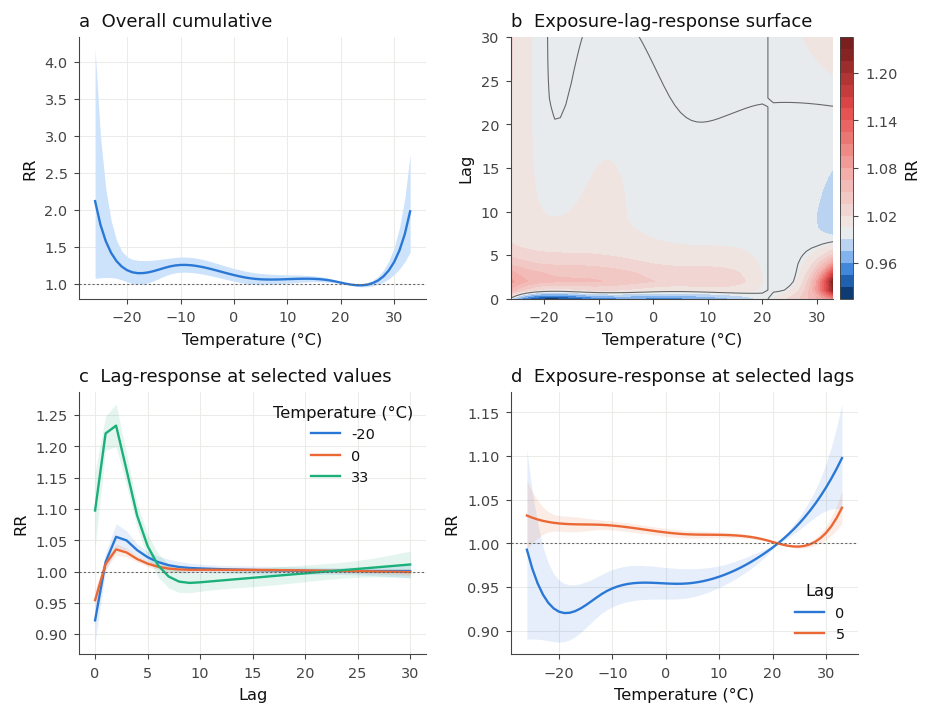

# dlnmpy

Distributed lag non-linear models (DLNMs) in Python.

`dlnmpy` is a from-first-principles port of the R package [`dlnm`](https://github.com/gasparrini/dlnm) by Antonio Gasparrini and Ben Armstrong. It reproduces the R package's cross-basis construction, prediction and reduction algorithms to machine precision, and it is built so that the same reference tests can be used to validate ports to other languages (Rust, Julia, JavaScript).

The package is validated against R on the `chicagoNMMAPS` examples from the `dlnm` vignettes: basis matrices, cross-basis matrices, predictions, confidence intervals and reduced coefficients agree with R to around 1e-12, and the statsmodels fitting path reproduces R's `glm()` coefficients to 1e-14 (see [Validation](#validation)).

## Why

DLNMs are the standard method for exposure-lag-response associations in environmental epidemiology, above all for temperature and mortality. The methodology lives in one R package. That is a problem for teams working in Python (Databricks, scikit-learn pipelines, deep learning workflows) and for anyone who wants to run the models in a compiled language at scale. This repository sets out to make the method itself portable: the algorithms are written down as a language-neutral specification, the numerical behaviour is pinned by fixtures generated from R, and the Python implementation is the first port.

## Installation

```bash
pip install git+https://github.com/Logic06183/dlnmpy.git
# or, for development
git clone https://github.com/Logic06183/dlnmpy.git && cd dlnmpy
pip install -e ".[dev]"
```

With conda, create the environment from the file in the repo (conda-forge packages plus dlnmpy from GitHub):

```bash
conda env create -f environment.yml && conda activate dlnmpy
```

or add the pip line to an existing environment. A conda-forge recipe is in `conda/`; it can be submitted once the package is on PyPI.

Requires Python 3.9+, numpy, scipy and pandas. `statsmodels` is needed to fit models through `fit_glm` and `matplotlib` for plotting; both are optional. The example datasets (`chicagoNMMAPS`, `drug`, `nested`) ship inside the package, so nothing from R is needed at any point; `dlnmpy.datasets.simulate_cities()` generates multi-location data for the two-stage examples.

## Quick start

The workflow is the same as in R: build a cross-basis, include it in a regression model, predict.

```python
import numpy as np
import dlnmpy as dl

chicago = dl.datasets.chicago_nmmaps()

# cross-basis for temperature: natural splines in both dimensions, lag 0-21
cb = dl.crossbasis(chicago.temp, lag=21,
                   argvar={"fun": "ns", "df": 4},
                   arglag={"fun": "ns", "df": 4})

# design matrix: cross-basis + seasonality/trend spline + day of week
ns_time = dl.onebasis(chicago.time, "ns", df=7 * 14)
X = dl.design_matrix(chicago, ("cb", cb), ("ns_time", ns_time), intercept=False)
data = chicago.join(X)
model = dl.fit_glm("death ~ " + " + ".join(X.columns) + " + C(dow)", data,
                   family="quasipoisson")

# predictions centred at 21C, for every integer temperature
pred = dl.crosspred(cb, model, cen=21, by=1, name="cb")
pred.plot("overall", xlab="Temperature", ylab="RR")
pred.plot("slices", var=[-20, 33], lag=[0, 5])
pred.overall()          # DataFrame with var, fit, low, high (RR scale)
pred.slice_var(33)      # lag-response curve at 33C

# reduce to one-dimensional summaries (for meta-analysis, say)
red = dl.crossreduce(cb, model, cen=21, name="cb")
red.coef, red.vcov
```

Any fitting library can be used. `crosspred` and `crossreduce` only need the coefficients and covariance matrix of the cross-basis columns, so you can also pass them directly:

```python
pred = dl.crosspred(cb, coef=beta, vcov=V, model_link="log", cen=21, by=1)
```

The `examples/chicago_timeseries.py` script reproduces the four examples of the R vignette *Distributed lag linear and non-linear models for time series data* and writes the figures to `examples/figures/`.

## What is implemented

| R (`dlnm`) | Python (`dlnmpy`) | Notes |
|---|---|---|
| `onebasis(x, fun, ...)` | `onebasis(x, fun, **args)` | returns `OneBasis` |
| `crossbasis(x, lag, argvar, arglag, group)` | `crossbasis(x, lag, argvar, arglag, group)` | returns `CrossBasis`; `x` may be a series or a matrix of exposure histories |
| `lin`, `poly`, `strata`, `thr`, `integer` | same names in `dlnmpy.basis` | |
| `splines::ns`, `splines::bs` | `ns`, `bs` | literal ports, including extrapolation beyond the boundary knots |
| `ps`, `cr` | `ps`, `cr` | penalised bases with their penalty matrices (`cr` ports mgcv's construction) |
| `logknots`, `equalknots` | `logknots`, `equalknots` | |
| `exphist` | `exphist` | |
| `crosspred(...)` | `crosspred(...)` | returns `CrossPred`; `from`/`to` are `from_`/`to` |
| `crossreduce(...)` | `crossreduce(...)` | returns `CrossReduce` |
| `cbPen` + `mgcv::gam(paraPen=)` | `cbpen` + `fit_pgam` | penalised DLNMs with REML/ML smoothing, validated against mgcv (`docs/penalized.md`) |
| `plot.crosspred` (`overall`, `slices`, `contour`, `3d`) | `CrossPred.plot(...)` | matplotlib |
| `plot.crossreduce` | `CrossReduce.plot(...)` | |
| `summary` methods | `.summary()` | |
| `chicagoNMMAPS`, `drug`, `nested` | `dlnmpy.datasets` | |

R argument spellings are accepted where they differ (`thr.value`/`thr`, `Boundary.knots`), so R code translates almost line by line. See `docs/r-to-python.md` for the full mapping and the differences that remain.

The cross-basis columns are named `v{i}.l{j}` as in R (or `{name}_v{i}_l{j}` in the DataFrame returned by `to_dataframe`, which is what `crosspred(..., name=...)` uses to find the right coefficients in a fitted model).

## Figures

Plots are designed for print: neutral sans-serif, thin marks, hairline gridlines, no top or right spines, a light-grey interval band and a dashed null-effect line, with `plot.set_theme("journal")` (greyscale, the default) or `plot.set_theme("colour")` (a colour-blind-safe palette validated for adjacent-pair separation: blue estimate, blue-to-red diverging surface with a neutral grey midpoint, fixed-order hues for overlays). Besides the four R plot types, `overlay_slices` draws several curves on one axis with a legend (the R `plot()` + `lines()` idiom) and `summary_figure` gives the standard four-panel figure (overall curve, surface, lag-response and exposure-response slices). All functions return matplotlib axes, so anything can be adjusted.



## Uncertainty beyond the delta method, and model selection

`dlnmpy.uncertainty` gives parametric-bootstrap intervals for any function of the coefficients (`bootstrap(fn, coef, vcov)`, `simulate_pred`, `empirical_ci`), the route used for the MMT and attributable numbers, and `qaic` with `model_grid` to compare cross-basis specifications by quasi-AIC (Gasparrini et al. 2010).

## Beyond the R package: attributable risk and the MMT

`dlnm` stops at prediction; the quantities papers actually report need Gasparrini's separate R scripts. Those are ported and validated here too (`dlnmpy.attribution`):

```python
res = dl.mmt(cb, model, x=chicago.temp, name="cb")       # minimum mortality temperature
res.mmt, res.low, res.high, res.percentile               # with empirical 95% CI and percentile

tab = dl.attr_table(chicago.temp, cb, chicago.death, model, cen=res.mmt, name="cb")
# component | range | an an_low an_high | af af_low af_high
# total, cold, heat, extreme cold, moderate cold, moderate heat, extreme heat

dl.attrdl(chicago.temp, cb, chicago.death, model, type="an", dir="forw", cen=res.mmt, name="cb")
```

`attrdl` is a port of `attrdl.R` (Gasparrini & Leone 2014): backward and forward perspectives, attributable numbers and fractions, daily or total, exposure ranges, reduced coefficients, and empirical intervals by simulation. `findmin` ports `findmin.R` (Tobías, Armstrong & Gasparrini 2017). Both match the R functions to 1e-8 or better on every deterministic quantity (`tests/test_attribution.py`); the simulation path is checked with the same coefficient draws in both languages. `mmt` and `attr_table` wrap them into the summaries used in practice, with one shared set of simulated coefficients so cold, heat and their extreme and moderate parts are mutually consistent. See `examples/attributable_risk.py`.

## Penalised DLNMs without mgcv

`fit_pgam` fits the penalised cross-basis models of Gasparrini et al. (2017) by penalised IRLS with smoothing parameters chosen by REML or ML (Wood 2011), reproducing `gam(..., paraPen=list(cb=cbPen(cb)), method="REML")`: scores to 1e-5, smoothing parameters to 1e-4, coefficients to 1e-4 or better against mgcv (`tests/test_penalized.py`). See `docs/penalized.md` and `examples/penalized_dlnm.py`.

## Two-stage designs: multivariate meta-analysis

Multi-location studies pool location-specific reduced coefficients with a multivariate random-effects meta-analysis; in R that is the `mixmeta` package. `dlnmpy.meta` implements the same model (single random level: REML, ML or fixed effects; unstructured, diagonal or identity between-location covariance; meta-regression; BLUPs with prediction intervals; Cochran's Q and I²), validated against `mixmeta` on a 12-location simulation.

```python
y, S = dl.stack_reduced([dl.crossreduce(cb_i, fit_i, cen=18, name="cb") for ...])
mm = dl.mixmeta(y, S, method="reml")                       # pooled coefficients, Psi, Q, I2
mr = dl.mixmeta(y, S, X=np.column_stack([np.ones(m), mean_temp]))   # meta-regression
pooled = dl.predict_reduced(cb_1, mm.coef_vec, mm.vcov, at=grid, cen=18)   # pooled curve (CrossPred)
blups = mm.blup(se=True)                                    # location-specific BLUPs and covariances
```

Where the two disagree it is because `mixmeta` stopped at its iteration limit: on the identity-structure fit R reports non-convergence and the Python optimum has a higher restricted log-likelihood by 0.76. For all converged fits coefficients, covariances, `Psi`, log-likelihood, AIC/BIC, Q, I², BLUPs and predictions agree to 1e-5 or better (1e-13 for fixed effects). See `examples/two_stage.py`.

## Validation

`tools/make_fixtures.R` runs the R package on the vignette examples and writes every intermediate object to `tests/fixtures/` as CSV and JSON: 32 basis-function specifications (with and without values outside the fitting range), 9 cross-bases, 12 prediction objects, 7 reductions, the penalty matrices, and R's `pretty()`, `quantile()` and knot helpers. The Python test-suite compares against these numbers with absolute tolerances of 1e-10 to 1e-12.

```
pytest            # 79 tests
```

A second, independent check lives in `tools/side_by_side.R` / `tools/side_by_side.py`: five complete analyses are run end to end in both languages, including the model fit, on data and specifications not used for the unit-test fixtures (the `drug` trial with OLS on exposure histories, the `nested` case-control study with conditional logistic regression, a logistic and a quasi-Poisson Chicago model with threshold, polynomial, strata and integer bases, 80% and 90% intervals, exposure-history matrices passed to `at`, and a four-city simulation with known truth). All 102 quantities compared agree to better than 1e-8; most to 1e-12. The report is printed by `python tools/side_by_side.py` and the test-suite runs it too.

Two things worth knowing about equivalence with R:

- R's `glm` handles rank-deficient designs by dropping aliased columns (reported as `NA`); statsmodels uses a pseudo-inverse and a numerical rank. `fit_glm` reproduces R's behaviour (drops aliased columns using the same criterion as LINPACK's `dqrdc2`, solves the IRLS step by QR, and computes the quasi-likelihood dispersion with R's residual degrees of freedom). This is why the example-1 coefficients agree to 1e-14 rather than 1e-6.
- R's `glm` stops iterating at a looser tolerance (`epsilon = 1e-8`) than `fit_glm` does; with R's default settings, standard errors differ from Python's at about 1e-7. Tightening R's `glm.control(epsilon = 1e-14)` brings the two to 1e-15, so the difference is R's convergence criterion, not the algorithms.
- Conditional logistic regression: statsmodels' default optimiser (BFGS) can stop on a flat likelihood with coefficients 0.02 away from `survival::clogit`, and its covariance is a numerical approximation. `fit_clogit` uses Newton-Raphson and an extrapolated finite-difference Hessian of the analytic score, which matches R to 1e-9.
- The reference level of categorical terms in patsy formulas is the first level in alphabetical order, as in R for character vectors; R factors with explicit levels may differ. This does not affect the cross-basis coefficients.

## Repository layout

```
src/dlnmpy/
  _rcompat.py    R's pretty(), quantile(type=7), median(), seq()   (ported from R source)
  _splines.py    splineDesign(), ns(), bs()                        (ported from R's splines)
  basis.py       lin, poly, strata, thr, integer, ns, bs, ps
  lag.py         mklag, seqlag, lag_matrix (tsModel::Lag), exphist
  knots.py       logknots, equalknots
  core.py        OneBasis, CrossBasis, onebasis(), crossbasis()
  predict.py     CrossPred, CrossReduce, crosspred(), crossreduce(), mkat, mkcen
  model.py       coefficient/vcov extraction, fit_glm (statsmodels), design_matrix
  penalty.py     cbpen
  penalized.py   fit_pgam / fit_pglm: penalised IRLS with REML/ML smoothing (mgcv's criterion)
  plot.py        matplotlib plots (journal style; plot.set_style())
  datasets.py    chicagoNMMAPS, drug, nested
docs/
  theory.md          the mathematics, written as a language-neutral specification
  r-to-python.md     API mapping and behavioural differences
  porting-guide.md   how to port to another language and validate with the fixtures
  penalized.md       status of penalised DLNMs
tests/               pytest suite + R-generated fixtures
tools/               make_fixtures.R
examples/            vignette reproduction
```

## Roadmap

1. Analytic derivatives for the penalised fitter (mgcv-speed smoothing parameter selection).
2. Parametric-bootstrap intervals for any derived quantity, and a Bayesian route (same design matrix in PyMC/numpyro).
3. Multilevel meta-analysis (nested random levels, as in `mixmeta`'s extended framework) and longitudinal/repeated-measures structures.
4. A Rust core with Python bindings, validated with the same fixtures.

## Prior work

Two earlier Python efforts exist: [aedessler/pydlnm](https://github.com/aedessler/pydlnm) (with meta-analysis and BLUPs, validated on multi-city data) and [`crossbasis`](https://pypi.org/project/crossbasis/) on PyPI. This repository differs in aiming for a literal, attribute-for-attribute port of the R algorithms (including R's own `pretty`, quantile and spline routines so defaults match), in shipping the R-generated fixtures as a language-neutral test oracle, and in documenting the method as a specification for further ports.

## References

- Gasparrini A, Armstrong B, Kenward MG. Distributed lag non-linear models. *Statistics in Medicine* 2010; 29(21):2224-2234.
- Gasparrini A. Distributed lag linear and non-linear models in R: the package dlnm. *Journal of Statistical Software* 2011; 43(8):1-20.
- Gasparrini A, Armstrong B. Reducing and meta-analysing estimates from distributed lag non-linear models. *BMC Medical Research Methodology* 2013; 13:1.
- Gasparrini A. Modeling exposure-lag-response associations with distributed lag non-linear models. *Statistics in Medicine* 2014; 33(5):881-899.
- Gasparrini A, Armstrong B, Kenward MG. Multivariate meta-analysis for non-linear and other multi-parameter associations. *Statistics in Medicine* 2012; 31(29):3821-3839.
- Sera F, Armstrong B, Blangiardo M, Gasparrini A. An extended mixed-effects framework for meta-analysis. *Statistics in Medicine* 2019; 38(29):5429-5444.
- Gasparrini A, Leone M. Attributable risk from distributed lag models. *BMC Medical Research Methodology* 2014; 14:55.
- Tobías A, Armstrong B, Gasparrini A. Investigating uncertainty in the minimum mortality temperature. *Epidemiology* 2017; 28(1):72-76.
- Wood SN. Fast stable restricted maximum likelihood and marginal likelihood estimation of semiparametric generalized linear models. *JRSS B* 2011; 73(1):3-36.
- Gasparrini A, Scheipl F, Armstrong B, Kenward MG. A penalized framework for distributed lag non-linear models. *Biometrics* 2017; 73(3):938-948.

## Licence

GPL-2.0-or-later. This is a derived work of the R package `dlnm` (GPL >= 2) and of R's `splines` and `base` packages (GPL >= 2), whose algorithms it reproduces. The `chicagoNMMAPS` data are redistributed from the `dlnm` package.
